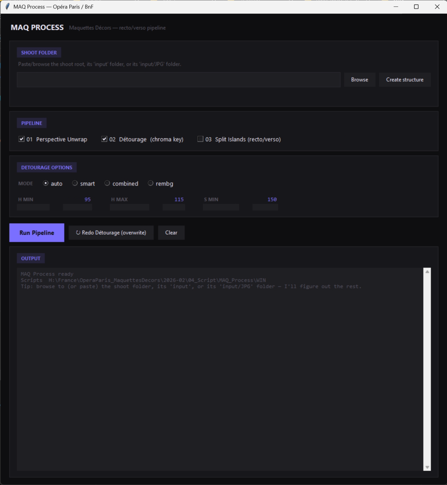

# ArucoWarp-ChromaKeying

**Automated perspective correction and background removal pipeline for flat object photography.**

Drop 4 ArUco markers on your shooting board, photograph your objects on a colored background — this tool handles the rest. Detects the markers, rectifies the perspective, removes the background, outputs clean transparent PNGs.

Built for the digitization of historical stage design maquettes (Opéra national de Paris, Bibliothèque nationale de France), but the pipeline is fully generic and works for any flat object on any colored background.

---

## Results

| Raw input | Perspective corrected | Final — transparent PNG |
|:---------:|:--------------------:|:-----------------------:|
|  |  |  |

*Wagner — La Walkyrie, 1893. Opéra national de Paris archives.*

---

## GUI



```powershell
uv run python WinMAQProcess.py
```

The path field accepts the shoot root, its `input` folder, or its `input/JPG` folder — paste or browse to any of them and it snaps back to the shoot root automatically. **Create structure** builds the missing sub-folders (`input`, `input/JPG`, `debug`, `output`, `output_det`) on the spot, which is handy the first time you point it at a shoot a student sent from their own machine. The status line under the path shows how many source images were actually found and where.

**↻ Redo Détourage (overwrite)** re-runs step 2 only, with whatever mode/sliders are currently set, without re-running the perspective unwrap — useful for iterating on a chroma key that didn't come out right.

---

## What it does

### Step 1 — Perspective Unwrap

Detects 4 ArUco fiducial markers (DICT_4X4_50, IDs 0–3) placed at the corners of the shooting board and applies a perspective transform to produce a clean, rectified crop — regardless of camera angle or position.

The detector tries 6 preprocessing strategies in sequence (original, CLAHE, histogram equalization, blur+CLAHE, wide blur, adaptive threshold) and stops at the first one that returns exactly 4 markers with unique IDs. Any result with duplicate IDs is automatically rejected — preventing false positives from color checkers, rulers, or labels present in the frame from corrupting the transform.

Source images are picked up from `input/JPG/` if present, falling back to `input/` directly for older shoots — so both folder conventions work without touching the script.

### Step 2 — Chroma Key Détourage

Removes the colored background using HSV-based analysis. Four modes available:

| Mode | Description |
|------|-------------|
| `auto` | Plain HSV chroma key — fast, conservative, works for most shoots |
| `smart` | Silhouette + plate-carve — for maquettes that themselves contain blue/teal *paint* (shutters, skies, water) that plain color keying would wrongly cut out |
| `combined` | Chroma key + AI (rembg) — better on complex shapes |
| `rembg` | AI only — for very intricate or unusual objects |

`smart` auto-calibrates the plate color from the image corners, then floods the background inward from the border through plate-colored pixels only — so enclosed blue paint that never touches the border edge is kept as part of the object, while the surrounding plate is removed.

Fine-tuning flags (all optional, safe defaults):

| Flag | Default | Effect |
|------|---------|--------|
| `--grow` | `0` | `[auto]` grow the cut by N px to trim a thin blue halo |
| `--spill` | `0.0` | Blue spill removal strength — keep at `0` on blue-heavy artwork or it dulls legitimate blue paint |
| `--close` | `3` | `[smart]` edge grow in px to swallow blue fringing |
| `--plate-frac` | `0.002` | `[smart]` minimum area fraction for a blue blob to count as background plate |

### Step 3 — Split Islands *(optional)*

Splits each détouré PNG into individual floating pieces ("islands") ready for recto/verso pairing downstream. This step calls `maq_split_islands.py`, which belongs to the [IslandSeparator_RectoVersoMatching-BlenderImporter](https://github.com/Braccialisme/IslandSeparator_RectoVersoMatching-BlenderImporter) repo — copy that script alongside `WinMAQProcess.py` (same folder) for this checkbox to work, or leave it unchecked and run the Island Process GUI from the other repo separately.

---

## Why these technical choices

### ArUco markers over manual cropping
ArUco markers (from OpenCV's `cv2.aruco` module) are specifically designed for reliable detection under real-world conditions: varying lighting, partial occlusion, motion blur. They encode an ID in a binary matrix pattern that is robust to perspective distortion — exactly what's needed when a camera is never perfectly orthogonal to the board. Detection is deterministic, fast (milliseconds per image), and requires no GPU or trained model.

Using 4 markers at known positions (the corners) turns any photograph into a calibrated document: the perspective transform is computed analytically from 4 point correspondences, with sub-pixel corner refinement (`CORNER_REFINE_SUBPIX`) for maximum geometric accuracy.

### Multi-preprocessing strategy with fallback
A single threshold setting fails when shooting conditions vary — darker frames, blown highlights, or shadows on the markers. Rather than asking the user to tune detection parameters per image, the script tries 6 preprocessing methods and takes the first clean result. This makes the pipeline resilient across an entire shoot without any manual intervention.

### HSV over RGB for chroma keying
RGB is not perceptually uniform — the same blue background looks very different in RGB values under different lighting conditions. HSV separates Hue (color identity) from Saturation (color purity) and Value (brightness), which maps much more cleanly to the human concept of "this is a blue background." By thresholding on Hue range + Saturation minimum, the mask captures the blue background reliably regardless of lighting variation across the frame, while ignoring blue-ish tones in the object itself (which tend to be desaturated).

### Border-flood ("smart") mode for blue-heavy artwork
Plain color keying can't tell plate-blue from painted-blue — a teal wash or blue shutter shares the same HSV slice as the background. `smart` adds a shape prior on top of color: only plate-colored pixels connected to the image border are treated as background. Anything the flood never reaches — including enclosed blue paint — is kept as part of the object.

### rembg as optional fallback
For objects with very complex silhouettes that HSV keying struggles with, [rembg](https://github.com/danielgatis/rembg) (U2Net) provides an AI-based fallback. In `combined` mode, the minimum of both alpha channels is used — taking the most conservative mask from each method, which tends to give the cleanest result on difficult cases.

---

## Requirements

- Python 3.10+
- [uv](https://github.com/astral-sh/uv) (recommended)

### Install uv (Windows)
```powershell
winget install astral-sh.uv
```

Dependencies are declared in `pyproject.toml` and installed automatically by uv on first run:
```
opencv-python, numpy, Pillow, numba
```
Optional for `combined` / `rembg` modes: `rembg`

---

## Folder structure

```
MY_SHOOT_NAME/
├── input/
│   └── JPG/        ← raw JPG photographs (new convention — local student uploads)
│       (or JPGs directly in input/, for older shoots)
├── output/         ← rectified images (created by PersUnwrap)
├── output_det/     ← transparent PNGs (created by Détourage)
├── debug/          ← ArUco detection debug images
└── islands/        ← individual piece crops (created by Split Islands, if run)
```

Both `input/JPG/*.jpg` and `input/*.jpg` are supported automatically — no per-shoot configuration needed.

---

## Command line

```powershell
# By full path
uv run python WinPersUnwrap.py --base-path "C:\path\to\shoot"
uv run python WinDetourage.py  --base-path "C:\path\to\shoot" --mode auto

# Smart mode, for maquettes with blue/teal paint
uv run python WinDetourage.py --base-path "C:\path\to\shoot" --mode smart --close 3 --plate-frac 0.002

# By shoot name (if base path is configured in the script)
uv run python WinPersUnwrap.py --shoot MY_SHOOT_NAME
uv run python WinDetourage.py  --shoot MY_SHOOT_NAME --mode combined --s-min 120
```

**Tuning tips (auto/smart stay conservative — they never grow into the object by default):**
- Too much plate left → raise `--s-min` a little
- Object edge eaten → lower `--s-min`
- Thin blue halo on edges → add a touch of `--grow 1`
- Colours look dulled → keep `--spill 0` (the default)
- Blue/teal *paint* in the artwork being wrongly removed → use `--mode smart`

---

## Shooting setup

- Colored background (default tuned for blue: H 95–115, S > 150 in HSV)
- 4 ArUco markers (DICT_4X4_50, IDs 0–3) at the corners of the board
- Static camera, consistent lighting
- Works with any background color — just retune the HSV range via sliders or CLI args

---

## Files

| File | Description |
|------|-------------|
| `WinMAQProcess.py` | GUI — chains Unwrap + Détourage (+ optional Split Islands), path-tolerant, with a Redo Détourage shortcut |
| `WinPersUnwrap.py` | Perspective correction via ArUco detection |
| `WinDetourage.py` | HSV chroma key background removal (`auto` / `smart` / `combined` / `rembg`) |
| `maq_split_islands.py` | *(not in this repo)* — from `IslandSeparator_RectoVersoMatching-BlenderImporter`; copy alongside to enable the Split Islands step in the GUI |
| `pyproject.toml` | Python dependencies |

---

## Context

This pipeline was developed for the digitization of historical set design maquettes from the archives of the **Opéra national de Paris** and the **Bibliothèque nationale de France** — unique hand-painted scale models representing stage décors for 19th and early 20th century productions. Each piece is a fragile, irreplaceable artifact requiring careful, consistent, and reproducible photographic documentation.

The same approach generalizes to any repeated flat-object photography workflow: artwork digitization, museum cataloguing, document scanning, product photography.

---

## License

MIT — use it for whatever you want. A mention is always appreciated.